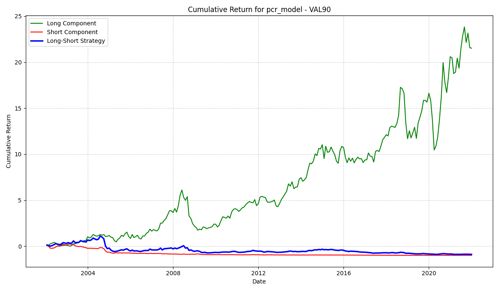

# PAPER Portfolio Example: Understanding the Long-Short Strategy

This document explains the logic behind the long-short portfolio construction used in this example and provides a guide to interpreting the resulting cumulative return plots.

A common point of confusion when analyzing long-short portfolios is understanding how the performance of the individual "long" and "short" legs contributes to the overall strategy's performance. It's possible for the long leg to show a massive positive cumulative return while the overall strategy is negative. This guide will clarify why.

## 1. How the Long-Short Strategy Works

A long-short strategy is designed to profit from the *relative* performance of two groups of assets, neutralizing broad market movements.

#### The Long Leg (The "Green Line")
- **Action**: You buy a portfolio of stocks you predict will perform well (the "winners").
- **Profit/Loss**: Your return is directly tied to the performance of these assets. If they go up 10%, your long leg makes +10%.
- **Formula**: `Return_Long = Asset_Return_Long`

#### The Short Leg (The "Red Line")
- **Action**: You short-sell a portfolio of stocks you predict will perform poorly (the "losers"). Shorting means you borrow shares, sell them, and hope to buy them back later at a lower price.
- **Profit/Loss**: Your profit is the *inverse* of the assets' performance. If the shorted stocks go **down** by 10% (a good prediction!), your short *position* makes a **+10%** profit.
- **Formula**: `Return_Short_Position = - (Asset_Return_Short)`

#### The Combined Strategy (The "Blue Line")
- **Action**: Each month, your total return is the sum of the returns from your long and short positions.
- **Formula**: `Strategy_Return = Return_Long + Return_Short_Position`
- **Which simplifies to**: `Strategy_Return = Return_Long - Asset_Return_Short`

This final formula is exactly what the `paper-portfolio` manager calculates each month as the `portfolio_return`.

## 2. The Paradox of Cumulative Returns

You might see a plot where:
- The Long Leg (green) has a cumulative return of +2,200%.
- The Short Position (red) has a cumulative return of -90%.
- The final Strategy (blue) has a negative cumulative return.

This seems counter-intuitive, but it is correct. The reason is that **cumulative returns are multiplicative (they compound), not additive.** The final performance of the strategy is the compounded result of its *monthly returns*, not the sum or difference of the final cumulative returns of its legs.

### A Concrete Example

Let's imagine a simple two-month period where our predictions are consistently wrong, and the "loser" stocks we shorted actually outperform the "winner" stocks we bought.

| Period      | Long Leg Return | Short Leg Asset Return | Short Position Return (`-Short Leg`) | **Strategy's Monthly Return (`Long - Short`)** |
| :---------- | :-------------- | :--------------------- | :----------------------------------- | :--------------------------------------------- |
| **Month 1** | +60%            | +70%                   | -70%                                 | 60% - 70% = **-10%**                           |
| **Month 2** | +60%            | +70%                   | -70%                                 | 60% - 70% = **-10%**                           |

Now, let's calculate the final cumulative return for each of the three lines on the plot.

#### 🟢 Green Line (Cumulative Long Return)
The long leg compounds its own impressive gains.
- After Month 1: `(1 + 0.60) - 1 = +60%`
- After Month 2: `(1.60) * (1 + 0.60) - 1 = 2.56 - 1 = +156%`
- **Final Result: +156%**

#### 🔴 Red Line (Cumulative Short Position Return)
The red line shows the performance of our *short position*. It compounds its own returns, which in this case are negative.
- After Month 1: `(1 - 0.70) - 1 = -70%`
- After Month 2: `(0.30) * (1 - 0.70) - 1 = 0.09 - 1 = -91%`
- **Final Result: -91%**

#### 🔵 Blue Line (Cumulative Strategy Return)
This is the most important line. It compounds the strategy's *actual monthly performance*.
- After Month 1: `(1 - 0.10) - 1 = -10%`
- After Month 2: `(0.90) * (1 - 0.10) - 1 = 0.81 - 1 = -19%`
- **Final Result: -19%**

### Conclusion

This example clearly shows a scenario where:
- The long leg has a massive **+156%** cumulative return.
- The short position has a **-91%** cumulative return.
- The overall strategy has a **-19%** cumulative return.

The final strategy performance is **not** `156% - 91%`. It is the result of compounding the consistent `-10%` monthly losses. A few bad months where the shorted assets dramatically outperform the long assets can destroy the overall strategy's performance, even if the long leg looks great in isolation.

When you look at the plots generated by `paper-portfolio`, remember:
- **Green Line**: The isolated performance of your long portfolio.
- **Red Line**: The isolated performance of your *short position* (i.e., it goes up when the shorted assets go down).
- **Blue Line**: The real, compounded performance of the combined long-short strategy. This is your ultimate measure of success.